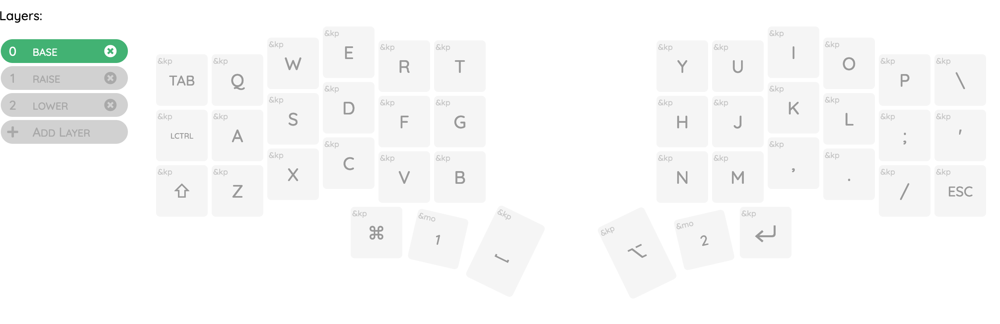

# Keymap Editor Demo - Corne

This is a customization of the ZMK config for the Corne keyboard with machine
readable layout and keymap definitions for use with my [keymap-editor] tool.

**⚠️ If you aren't here to see how you can use my [keymap-editor] you would be
better off not forking this repository.**

It's not that you _can't_ or are not welcome to, but as I made this is for
demonstration purposes I've never actually tested it on a corne keyboard. You're
just better off using the one that is provided in the ZMK repo.

[keymap-editor]:https://github.com/nickcoutsos/keymap-editor